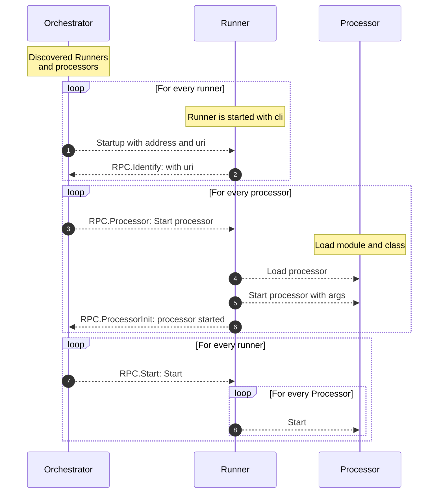
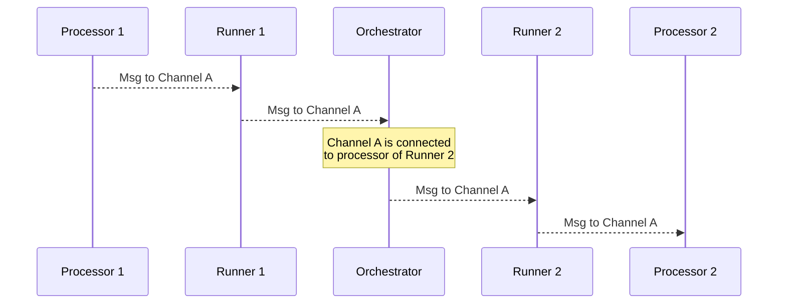

# Orchestrator Javascipt edition

### Install

```bash
npm install
npm test
```

### Run

```bash
node bin/runner.js ./pipeline.ttl
```

### Diagrams

<details>
  <summary>Initialization sequence diagram</summary>



</details>

<details>
    <summary>Message sequence diagram</summary>



</details>

Streaming messages vs blob messages.
Reader can have methods: asStreamReader or asBlobReader.
Same with writers

Can Kafka handle streaming body messages?

We need some metrics.
