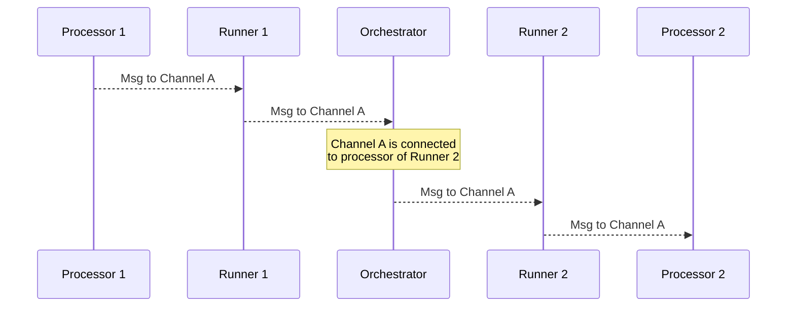

# Orchestrator JS

A JavaScript/TypeScript implementation of an RDF-based orchestrator for managing and executing data processing pipelines.

## Table of Contents

- [Features](#features)
- [Installation](#installation)
- [Usage](#usage)
    - [CLI](#cli)
    - [Programmatic API](#programmatic-api)
- [Configuration](#configuration)
- [Architecture](#architecture)
- [Development](#development)
    - [Prerequisites](#prerequisites)
    - [Building](#building)
    - [Testing](#testing)
    - [Linting & Formatting](#linting--formatting)
- [Contributing](#contributing)
- [License](#license)

## Features

- 🚀 **Pipeline Management**: Define and manage data processing pipelines using RDF
- ⚡ **TypeScript Support**: Built with TypeScript for better developer experience
- 🔄 **Modular Architecture**: Easily extensible with custom processors and runners
- 🧪 **Test Coverage**: Comprehensive test suite with Vitest
- 🛠️ **Developer Tools**: ESLint and Prettier for code quality

## Installation

```bash
# Clone the repository
git clone https://github.com/rdf-connect/orchestrator-js.git
cd orchestrator-js

# Install dependencies
npm install

# Build the project
npm run build

# Run tests
npm test
```

## Usage

### CLI

The orchestrator can be run using the provided CLI:

```bash
# Run with a pipeline configuration
node bin/orchestrator.js path/to/your/pipeline.ttl

# Or using the installed binary (if installed globally)
rdfc path/to/your/pipeline.ttl
```

### Programmatic API

```typescript
import { Orchestrator } from '@rdfc/orchestrator-js'

// Initialize with your configuration
const orchestrator = new Orchestrator({
    // Configuration options
})

// Start the orchestrator
await orchestrator.start()
```

## Configuration

Pipeline configurations are defined using RDF/Turtle format. Here's an example configuration:

```turtle
@prefix rdfc: <https://w3id.org/rdf-connect#>.
@prefix owl: <http://www.w3.org/2002/07/owl#>.

### Import runners and processors
<> owl:imports <./.venv/lib/python3.13/site-packages/rdfc_runner/index.ttl>.
<> owl:imports <./.venv/lib/python3.13/site-packages/rdfc_log_processor/processor.ttl>.


### Define the channels
<channel> a rdfc:Writer, rdfc:Reader.


### Define the pipeline
<> a rdfc:Pipeline;
   rdfc:consistsOf [
       rdfc:instantiates rdfc:PyRunner;
       rdfc:processor <log>, <send>;
   ].


### Define the processors
<send> a rdfc:SendProcessorPy;
       rdfc:writer <channel>;
       rdfc:msg "Hello, World!", "Good afternoon, World!",
                "Good evening, World!", "Good night, World!".

<log> a rdfc:LogProcessorPy;
      rdfc:reader <channel>;
      rdfc:level "info";
      rdfc:label "test".


```

## Development

### Prerequisites

- Node.js 16+
- npm 7+ or yarn
- TypeScript 4.7+

### Building

```bash
# Install dependencies
npm install

# Build the project
npm run build

# Watch for changes
npm run build -- --watch
```

### Testing

```bash
# Run tests
npm test

# Run tests with coverage
npm test -- --coverage

# Run specific test file
npm test path/to/test/file.test.ts
```

### Linting & Formatting

```bash
# Run linter
npm run lint

# Fix linting issues
npm run lint -- --fix

# Format code
npm run format
```

## Project Structure

```
orchestrator-js/
├── bin/                  # Executable scripts
│   └── orchestrator.js   # Main CLI entry point and pipeline executor
├── lib/                  # Compiled JavaScript output
├── src/                  # TypeScript source files
│   ├── index.ts          # Main export
│   ├── instantiator.ts   # Runner instantiation logic
│   ├── jsonld.ts         # JSON-LD utilities
│   ├── logUtil.ts        # Logging utilities
│   ├── model.ts          # Data models and types
│   ├── orchestrator.ts   # Core orchestrator logic
│   ├── server.ts         # Server implementation
│   └── util.ts           # Utility functions
├── __tests__/            # Test files
├── package.json          # Project configuration
└── tsconfig.json         # TypeScript configuration
```

## API Reference

### Orchestrator

The main class that manages the pipeline execution.

```typescript
interface OrchestratorOptions {
    configPath?: string // Path to RDF configuration
    logger?: Logger // Custom logger instance
    // Additional options...
}

class Orchestrator {
    constructor(options: OrchestratorOptions)

    // Start the orchestrator
    start(): Promise<void>

    // Stop the orchestrator
    stop(): Promise<void>

    // Get current status
    getStatus(): OrchestratorStatus
}
```

### Runner

Handles the execution of processing tasks.

```typescript
interface RunnerOptions {
    id: string // Unique runner ID
    // Runner configuration...
}

class Runner {
    constructor(options: RunnerOptions)

    // Start the runner
    start(): Promise<void>

    // Execute a processing task
    execute(task: Task): Promise<Result>
}
```

## Contributing

Contributions are welcome! Please follow these steps:

1. Fork the repository
2. Create a feature branch (`git checkout -b feature/AmazingFeature`)
3. Commit your changes (`git commit -m 'Add some AmazingFeature'`)
4. Push to the branch (`git push origin feature/AmazingFeature`)
5. Open a Pull Request

### Commit Message Guidelines

We follow [Conventional Commits](https://www.conventionalcommits.org/) for commit messages:

- `feat`: New feature
- `fix`: Bug fix
- `docs`: Documentation changes
- `style`: Code style changes (formatting, etc.)
- `refactor`: Code refactoring
- `test`: Adding or modifying tests
- `chore`: Build process or auxiliary tool changes

Example:

```
feat: add user authentication
fix: resolve memory leak in processor
```

## License

This project is licensed under the MIT License - see the [LICENSE](LICENSE) file for details.

---

## Architecture

The system follows a modular architecture with the following main components:

- **Orchestrator**: Manages the overall pipeline execution
- **Runners**: Handle the execution of processing tasks
- **Processors**: Individual processing units that transform or analyze data
- **Server/Client**: Communication layer between components

### Sequence Diagrams

#### Initialization Sequence

<details>
  <summary>Initialization sequence diagram</summary>


</details>

<details>
    <summary>Message sequence diagram</summary>



</details>

<details>
    <summary>Streaming message sequence diagram</summary>


</details>
